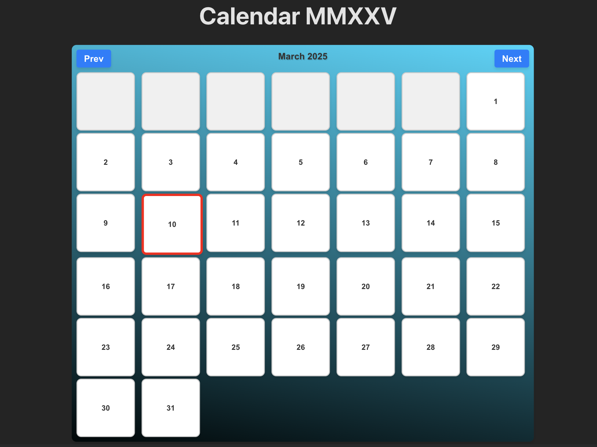

# 📅 Calendar App

Welcome to **Calendar App**! 🎉 A sleek and modern calendar application built with **React** and **Vite** to help you stay organized and productive. 🚀

## 🌟 Features

✅ **Beautiful UI** – A clean and responsive design for an enhanced user experience.  
✅ **Event Management** – Add, edit, and delete events effortlessly.  
✅ **Dynamic Navigation** – Navigate through months smoothly.  
✅ **Fast & Lightweight** – Powered by **Vite** for lightning-fast performance.  
✅ **Modern Tech Stack** – Built using **React 19** and **ES Modules**.

## 🚀 Getting Started

Follow these steps to set up and run the project locally:

### 1️⃣ Clone the Repository
```bash
git clone https://github.com/stoyangalchev/Calendar.git
cd calendar-app
```

### 2️⃣ Install Dependencies
```bash
npm install
```

### 3️⃣ Start Development Server
```bash
npm run dev
```

### 4️⃣ Build for Production
```bash
npm run build
```

### 5️⃣ Preview Production Build
```bash
npm run preview
```

## 🛠 Tech Stack

- ⚛ **React 19** – Frontend Framework  
- ⚡ **Vite** – Fast Build Tool  
- 🏗 **ES Modules** – Modern JavaScript approach  
- 🎨 **CSS** – Custom styling for an elegant look  

## 📷 Screenshots



## 🏗 Future Enhancements

🚀 **Dark Mode** – A sleek night-friendly theme.  
📅 **Event Reminders** – Get notifications for upcoming events.  
🔄 **Sync with Google Calendar** – Integrate with external calendars.  

## 🤝 Contributing

We welcome contributions! Feel free to **fork** the repo and submit **pull requests**. 🙌

## 📄 License
MIT 

---

Made with ❤️ by [Stoyan Galchev](https://github.com/stoyangalchev) ✨

